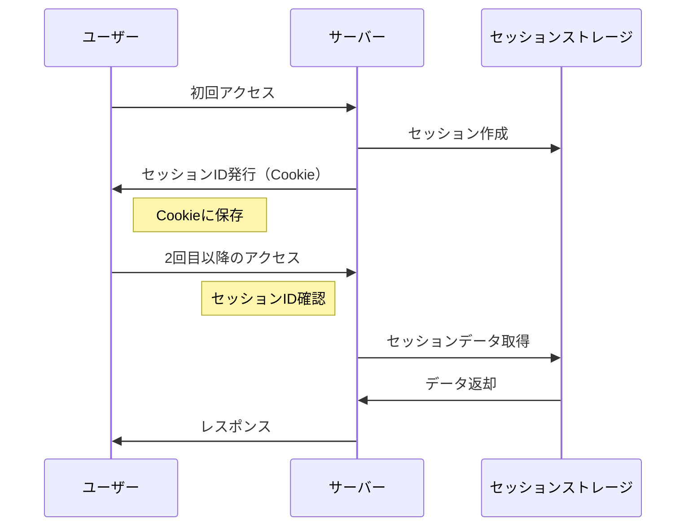

# セッション (Session)

## 概要

!!! note "一言で言うと"
    Webサイトで一連のやり取りを一時的に記録・管理する仕組み。ログイン状態の維持などに使用される。

## 詳細説明

セッションとは、Webサイトにおいてユーザーとサーバー間の一連のやり取りを一時的に記録・管理する仕組みです。HTTPは本来ステートレス（状態を持たない）なプロトコルですが、セッションを使用することで、ユーザーの状態を維持することができます。

### セッションの主な用途

- ログイン状態の維持
- ショッピングカートの管理
- ユーザー設定の一時保存
- 複数ページにまたがるフォームの入力データの保持

### セッションの仕組み

1. ユーザーが最初にWebサイトにアクセスした際、サーバーは一意のセッションIDを生成
2. セッションIDはクライアント側にCookieとして保存
3. 以降のリクエストでは、このセッションIDを使ってユーザーを識別
4. サーバー側でセッションデータを保管・管理

### シーケンス図

### 関連知識
- HttpOnly属性
  - クライアント側のJavaScriptからCookieを読み取れないようにする
  - XSS攻撃を受けた際にCookieが漏洩するのを防ぐ
- Secure属性
  - HTTPSでのみCookieを送信する
  - クライアントとサーバー間の通信が暗号化されていることを確認
- SameSite属性
  - クロスサイトリクエストでCookieを送信しないようにする
  - クロスサイトリクエスト攻撃を防ぐ

